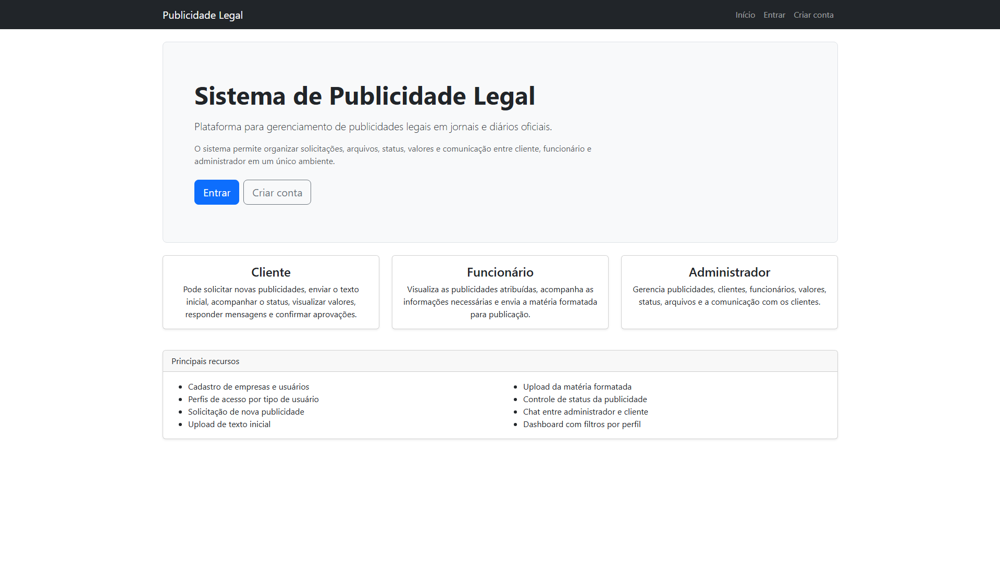
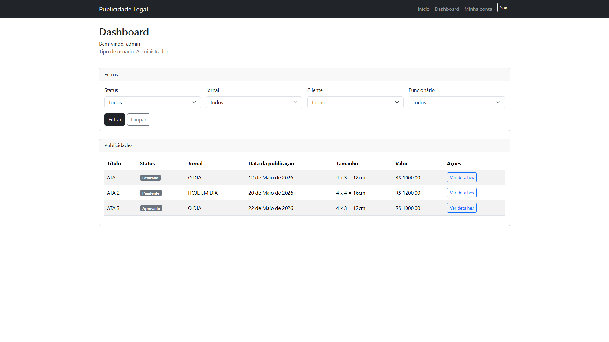

# Legal Publication Management

Sistema web para gerenciamento de publicidade legal em jornais e diários oficiais.

## Capturas de tela

### Página inicial

### Dashboard

# Tecnologias utilizadas

- Python
- Django
- MySQL
- HTML/CSS
- JavaScript
- Bootstrap

# Funcionalidades implementadas

- Cadastro de usuários com diferentes perfis:
  - Administrador
  - Funcionário
  - Cliente
- Login e logout
- Dashboard com informações diferentes para cada tipo de usuário
- Solicitação de nova publicidade pelo cliente
- Upload da matéria formatada pelo funcionário
- Chat entre administrador e cliente
- Controle de status da publicidade
- Edição de dados da publicidade pelo administrador
- Controle de valor da publicidade
- Registro interno do tamanho da publicidade
- Mensagens de feedback para ações realizadas

# Estrutura do projeto

- `usuarios`: gerenciamento de empresas e usuários
- `publicacoes`: cadastro e acompanhamento das publicidades
- `core`: páginas principais, login, cadastro, dashboard e fluxos do sistema

# Objetivo do projeto

Este projeto está sendo desenvolvido como parte do meu portfólio, com o objetivo de praticar modelagem de banco de dados, autenticação, permissões e desenvolvimento de sistemas web com Django.